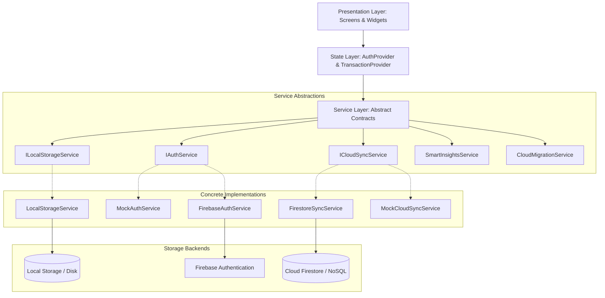
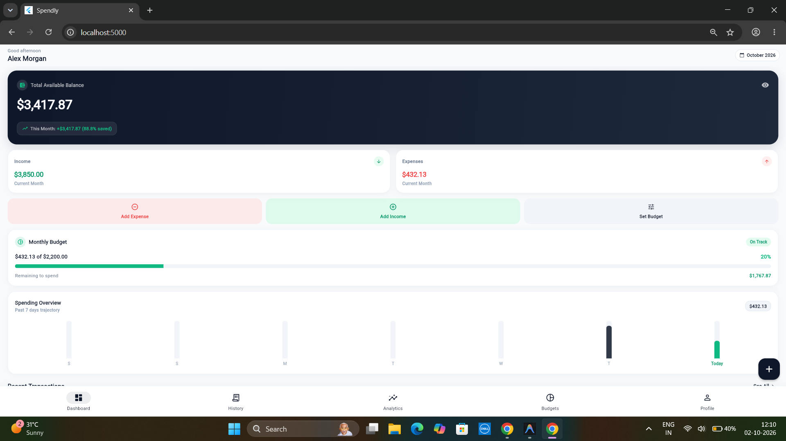
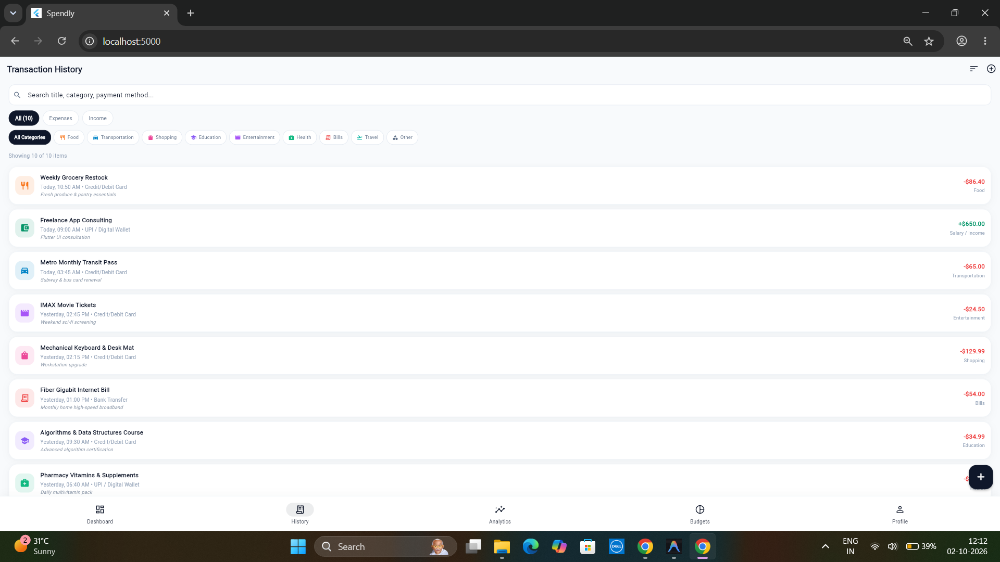
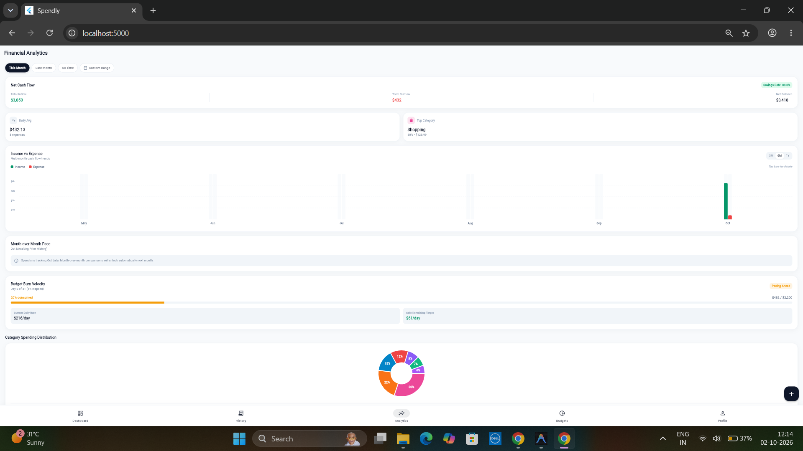
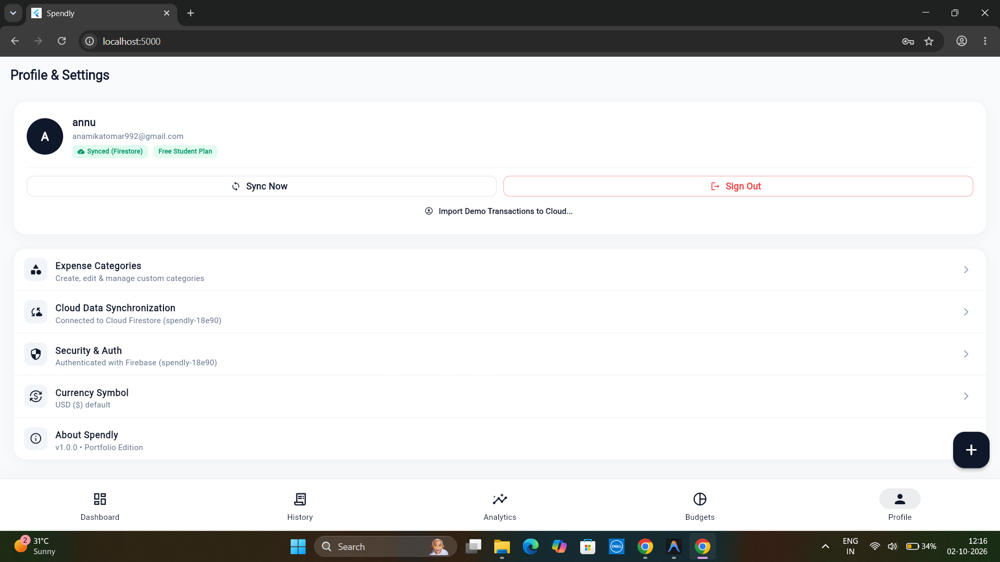

# Spendly — Smart Expense Intelligence & Personal Finance Tracker

[](https://flutter.dev)
[](https://dart.dev)
[](https://firebase.google.com)
[](https://opensource.org/licenses/MIT)
[](#test-suite--quality-assurance)

Spendly is a cross-platform personal finance tracker and expense intelligence application built with **Flutter**, **Provider**, and **Firebase**. It provides local-first offline resilience, rule-based proactive financial insights, dynamic budgeting analytics, and cloud synchronization with per-user data isolation.

---

## Table of Contents

- [Overview & Problem Statement](#overview--problem-statement)
- [Key Features](#key-features)
- [Tech Stack & Dependencies](#tech-stack--dependencies)
- [Software Architecture](#software-architecture)
- [Firebase Integration & Security](#firebase-integration--security)
- [Offline-First Architecture & Multi-Device Sync](#offline-first-architecture--multi-device-sync)
- [Screenshots](#screenshots)
- [Getting Started & Installation](#getting-started--installation)
- [Test Suite & Quality Assurance](#test-suite--quality-assurance)
- [Current Verification Status & Roadmap](#current-verification-status--roadmap)

---

## Overview & Problem Statement

Most mobile expense tracking applications either:
1. Require immediate mandatory cloud account registration before any usage.
2. Silently fail or lock up when operating without an active internet connection.
3. Lack transparent conflict resolution and duplicate transactions across multiple devices or browser sessions.

**Spendly** solves this by adopting an **offline-first, local-first architecture**:
* New users can immediately track income and expenses locally without signing in.
* Full offline capability with persistent local storage (`SharedPreferences`).
* Frictionless cloud upgrade to **Firebase Authentication** and **Cloud Firestore** when ready.
* Deterministic conflict resolution using UTC **Last-Write-Wins (LWW)** and persistent deletion tombstones.

---

## Key Features

### 1. Financial Dashboard & Overview
* **Real-time Balance Cards:** Net balance, total income, and total expenses with privacy visibility toggle.
* **Monthly Budget Burn Rate:** Visual progress bar tracking spending percentage against monthly budget limits.
* **Proactive Financial Insights:** Rule-based analytics generating actionable alerts (e.g., high burn rate, category concentration, month-over-month variances).
* **Quick-Add Actions:** Instant modal triggers for logging income and expenses.

### 2. Transaction Management & Organization
* **Comprehensive Details:** Title, amount, transaction type (income/expense), date picker, category, payment method (Card, Cash, Bank Transfer, UPI / Digital Wallet), and optional notes.
* **Search & Multi-Filtering:** Real-time search across titles, notes, categories, and amounts with type and category filtering.
* **Sorting Engine:** Sort by newest date, oldest date, highest amount, or lowest amount.
* **Safe Deletions:** Swipe-to-delete with temporary Undo buffer and persistent tombstone tracking.

### 3. Analytics & Visualization
* **Category Breakdown:** Interactive donut charts powered by `fl_chart` with percentage distribution.
* **Month-over-Month Comparison:** Comparative income vs. expense performance indicators.
* **Flexible Timeframes:** Filter analytics across This Month, Last Month, All Time, or Custom Date Ranges.
* **Historical Trend Views:** Configurable multi-month trend tracking (3, 6, or 12 months).

### 4. Budgets & Custom Categories
* **Monthly Limit Management:** Dynamic spending thresholds with automated daily allowance calculation.
* **Default & Custom Categories:** 10 pre-configured color-coded categories plus user-created custom categories with customizable icon and color pickers.
* **Referential Integrity:** Deleting a category prompts transaction reassignment to prevent orphaned records.

### 5. Authentication & Cloud Profile
* **Email & Password Authentication:** Register, sign in, reset password, and sign out via Firebase Auth.
* **Session Isolation:** Guest data and authenticated user data are kept strictly separated.
* **Real-Time Sync Status Pill:** Transparent visual indicator distinguishing `Local Only`, `Syncing...`, `Synced (Firestore)`, and `Sync Failed` states.
* **Sample Data Import Control:** Guest seed data is strictly isolated on fresh browser sessions and only migrated to cloud with explicit user consent.

---

## Tech Stack & Dependencies

| Layer | Technology | Details |
| :--- | :--- | :--- |
| **Framework** | [Flutter 3.3+](https://flutter.dev) | Cross-platform UI toolkit targeting Web, Android, iOS |
| **Language** | [Dart 3.3+](https://dart.dev) | Modern typed language with pattern matching and sound null safety |
| **State Management** | [Provider](https://pub.dev/packages/provider) `^6.1.2` | Clean dependency injection and ChangeNotifier state separation |
| **Data Visualization** | [fl_chart](https://pub.dev/packages/fl_chart) `^0.68.0` | Responsive charts (Donut category breakdowns, Bar comparisons) |
| **Local Persistence** | [shared_preferences](https://pub.dev/packages/shared_preferences) `^2.2.3` | User-partitioned offline key-value storage |
| **Identity & Auth** | [firebase_auth](https://pub.dev/packages/firebase_auth) `^5.3.1` | Email/password authentication and persistent session management |
| **Cloud Database** | [cloud_firestore](https://pub.dev/packages/cloud_firestore) `^5.4.4` | NoSQL document database with per-user collection rules |
| **Utilities** | [intl](https://pub.dev/packages/intl) `^0.19.0`, [uuid](https://pub.dev/packages/uuid) `^4.4.0` | Currency/date formatting and RFC4122 v4 unique ID generation |
| **Code Quality** | `flutter_lints` `^4.0.0`, `flutter_test` | Strict static analysis and 36 unit/widget tests |

---

## Software Architecture

Spendly follows a decoupled, testable **Clean Layered Architecture** using abstract service contracts and dependency injection:



### Architectural Highlights
* **Interface-Driven Design:** UI components and state providers depend exclusively on abstract interfaces (`ILocalStorageService`, `IAuthService`, `ICloudSyncService`).
* **Deterministic Testability:** Every cloud or storage operation can be swapped with mock implementations (`MockAuthService`, `MockCloudSyncService`) for offline environments or fast CI test runs.
* **Safe Initialization (`FirebaseConfig`):** Automatically detects whether Firebase credentials are configured. If unconfigured or forced, it falls back to mock/local mode without runtime crashes.

---

## Firebase Integration & Security

### Firestore Security Rules
All financial documents are strictly scoped to the authenticated user ID. Arbitrary root-level access is denied by default.

```javascript
rules_version = '2';
service cloud.firestore {
  match /databases/{database}/documents {
    // Deny arbitrary global access
    match /{document=**} {
      allow read, write: if false;
    }

    // Strict per-user collection partitioning
    match /users/{userId} {
      allow read, write: if request.auth != null && request.auth.uid == userId;

      match /transactions/{transactionId} {
        allow read, write: if request.auth != null && request.auth.uid == userId;
      }
      match /custom_categories/{categoryId} {
        allow read, write: if request.auth != null && request.auth.uid == userId;
      }
      match /budget/{budgetId} {
        allow read, write: if request.auth != null && request.auth.uid == userId;
      }
    }
  }
}
```

---

## Offline-First Architecture & Multi-Device Sync

Spendly includes a hardened synchronization engine ([CloudMigrationService](lib/services/cloud_migration_service.dart)) designed to eliminate data corruption across devices:

1. **Fresh-Session Demo Isolation:**
   When opening the app in a new browser session or incognito tab, sample demo data is kept in anonymous storage. Upon signing in, demo data is **never** injected into the user's cloud account unless the user explicitly opts in via profile settings.
2. **Zombie Resurrection Prevention (Cloud Tombstones):**
   Deletions record a persistent tombstone locally and upload a soft-delete document (`isDeleted: true`, `updatedAt: UTC`) to Firestore. Secondary devices holding stale cached records honor remote tombstones and purge them locally rather than re-uploading them.
3. **UTC Timestamp Normalization:**
   All `updatedAt` timestamps are normalized to UTC (`.toUtc().toIso8601String()`) before serialization, ensuring **Last-Write-Wins (LWW)** conflict resolution is consistent across different time zones.
4. **Sync Concurrency Guard:**
   `TransactionProvider.syncWithCloud` features an active reentrancy lock (`_isSyncing`) preventing overlapping executions from corrupting local storage state.
5. **Accurate Error Lifecycle:**
   Every cloud operation sets an explicit `Syncing...` state before network calls, populates human-readable error messages on failure, and automatically dismisses error banners upon recovery.

---

## Screenshots

### Core Experience & Tracking

| Financial Dashboard & Insights | Transaction History & Filters |
| :---: | :---: |
|  |  |
| *Real-time balance tracking, monthly budget progress, and proactive smart insights.* | *Categorized transaction records with real-time search, multi-filtering, and sorting.* |

### Financial Analytics & Cloud Sync

| Analytics & Spending Trends | Profile & Cloud Synchronization |
| :---: | :---: |
|  |  |
| *Interactive expense breakdowns, donut distribution charts, and period filtering.* | *Firebase account management with real-time sync status indicators and data isolation.* |

---

## Getting Started & Installation

### Prerequisites
* [Flutter SDK](https://docs.flutter.dev/get-started/install) (`>= 3.3.0`, tested on `3.47.x`)
* [Dart SDK](https://dart.dev/get-dart) (`>= 3.3.0`, tested on `3.13.x`)
* Web Browser (Chrome/Edge/Firefox) or Android/iOS Emulator

### 1. Clone the Repository

> [!NOTE]
> **Temporary:** The repository clone URL will be updated here after creating the GitHub repository.

```bash
git clone https://github.com/<your-username>/spendly.git
cd spendly
```

### 2. Install Dependencies
```bash
flutter pub get
```

### 3. Environment Setup & Execution Modes

Spendly is architected to run immediately in **Mock Mode** without requiring a Firebase account, or in **Live Cloud Mode** with your own Firebase project.

#### Option A: Running in Mock Mode (Zero Firebase Setup Required)
Spendly includes a safe fallback engine (`FirebaseConfig.initializeSafely()`) that automatically provides `MockAuthService` and `MockCloudSyncService` if real Firebase credentials are not provided.

1. Create a local options file from the provided template:
   ```bash
   # On macOS / Linux:
   cp lib/firebase_options.dart.example lib/firebase_options.dart

   # On Windows (PowerShell):
   Copy-Item lib/firebase_options.dart.example lib/firebase_options.dart

   # On Windows (Command Prompt):
   copy lib\firebase_options.dart.example lib\firebase_options.dart
   ```
2. Launch Spendly in your browser:
   ```bash
   flutter run -d chrome
   ```
   *The app will automatically run in local/mock mode with persistent offline storage.*

---

#### Option B: Connecting Your Own Firebase Project (For Live Cloud Sync)
To connect Spendly to your own Firebase backend:

1. Create a Firebase project at the [Firebase Console](https://console.firebase.google.com).
2. Enable **Email/Password** under **Build > Authentication > Sign-in method**.
3. Create a **Cloud Firestore** database in your preferred region.
4. Install the FlutterFire CLI and configure the app for Web and Android:
   ```bash
   dart pub global activate flutterfire_cli
   flutterfire configure --project=<your-firebase-project-id>
   ```
   *(This automatically generates your personal `lib/firebase_options.dart` and `android/app/google-services.json`).*
5. Deploy Firestore Security Rules to your project:
   ```bash
   firebase deploy --only firestore:rules
   ```
6. Launch Spendly with live multi-device cloud sync:
   ```bash
   flutter run -d chrome
   ```

### 4. Build for Production Web
```bash
flutter build web --release
```

---

## Test Suite & Quality Assurance

Spendly maintains an automated test suite verifying business logic, local storage recovery, authentication transitions, and multi-device sync conflict resolution.

> [!IMPORTANT]
> **Prerequisite:** Ensure `lib/firebase_options.dart` has been created from `lib/firebase_options.dart.example` (or generated via `flutterfire configure`) before running tests or static analysis.

Run static analysis:
```bash
flutter analyze
```

Execute all automated unit and integration tests:
```bash
flutter test
```

### Test Coverage Highlights
* **LocalStorage Tests:** Validates seed initialization, corrupted JSON recovery, and user-partitioned keys.
* **TransactionProvider Tests:** Validates CRUD operations, search filters, sorting, undo buffer, and budget utilization calculations.
* **SmartInsightsService Tests:** Validates threshold detection (burn rate alerts, category concentration warnings, savings praise).
* **Multi-User Isolation Tests:** Verifies User A's financial records are inaccessible to User B on shared devices.
* **Phase 6.1 Data Integrity Tests:**
  - Fresh-session demo isolation without consent.
  - Prevention of deleted transaction resurrection across secondary devices.
  - UTC timestamp normalization and backwards compatibility.
  - Reentrancy locks during concurrent sync executions.
  - Sync error state transitions and retry recovery.

---

## Current Verification Status & Roadmap

### Verification Status
* [x] **Local Architecture & Providers:** Fully implemented and validated.
* [x] **Firebase Authentication & Firestore Sync:** Integrated and unit-tested.
* [x] **Transaction & Tombstone Sync Integrity:** Automated tests passing (Phase 6.1).
* [ ] **Budget & Custom Category Cross-Device Persistence:** Automated architecture implemented; live manual multi-device verification is currently pending (Phase 6.2).

### Future Roadmap
* **Real-time Push Updates:** Integrate Firestore `.snapshots()` stream subscriptions to automatically push changes to secondary devices without manual sync triggers.
* **Category & Budget Cloud Tombstones:** Extend soft-deletion tombstone tracking to custom categories and monthly budgets.
* **Receipt Capture & OCR:** Machine-learning driven receipt scanning to auto-fill transaction titles and amounts.
* **Biometric Lock:** Fingerprint and FaceID app lock support on iOS and Android.
* **CSV / PDF Export:** Export transaction histories for tax reporting and personal backup.

---

## License

This project is licensed under the MIT License - see the [LICENSE](LICENSE) file for details.
